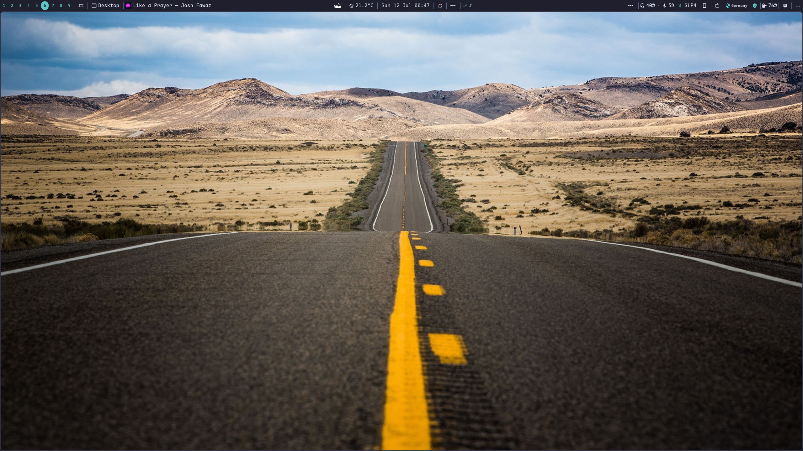
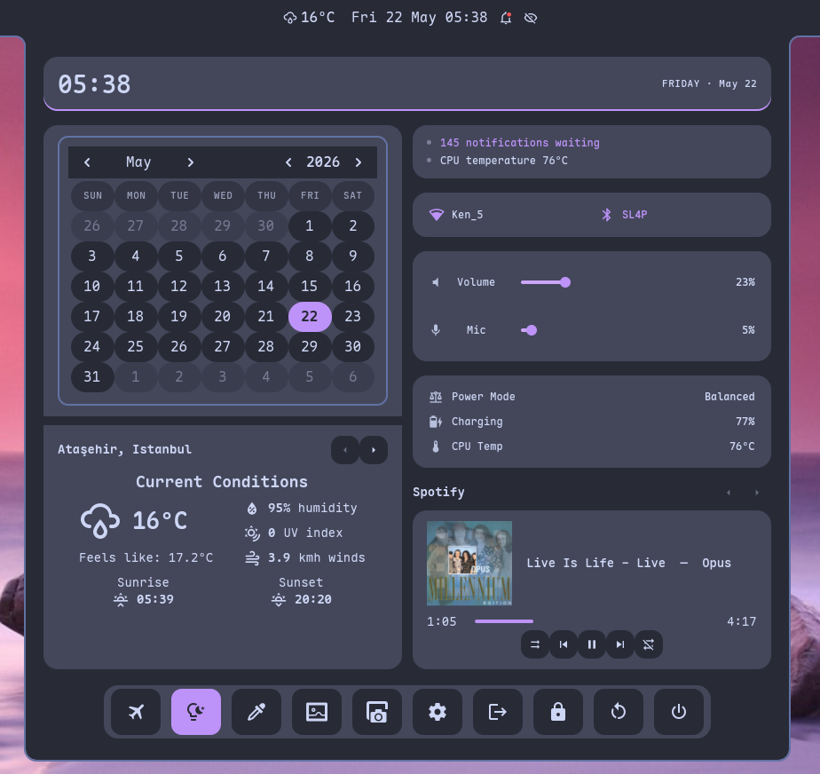
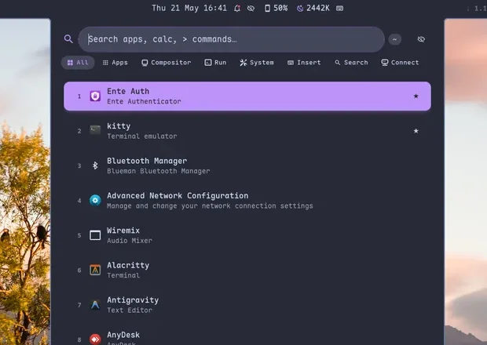
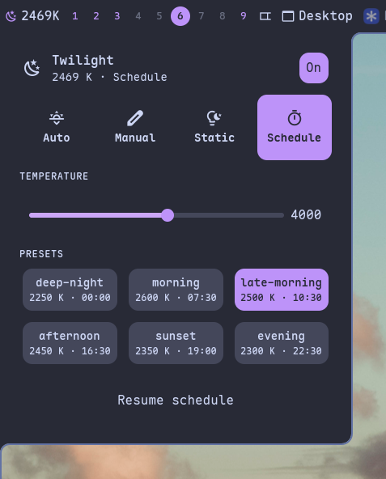
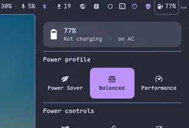
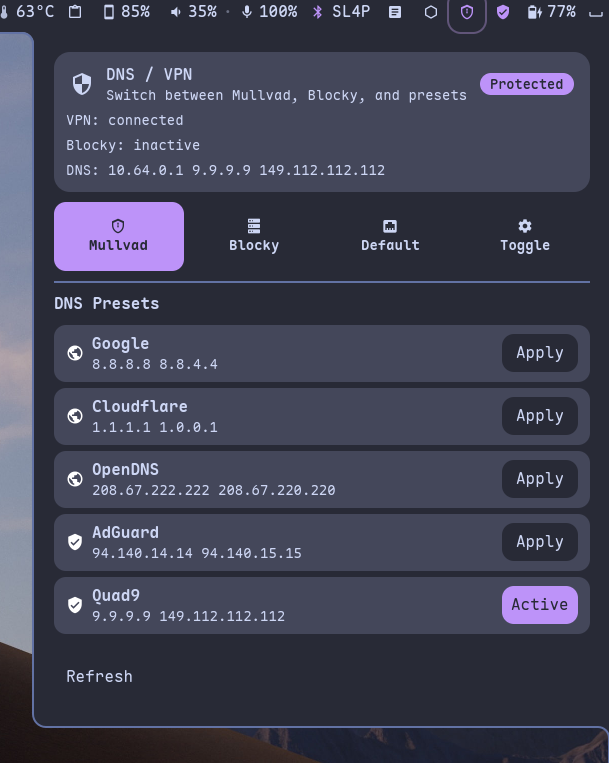
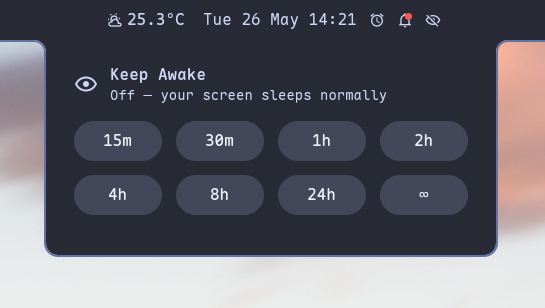
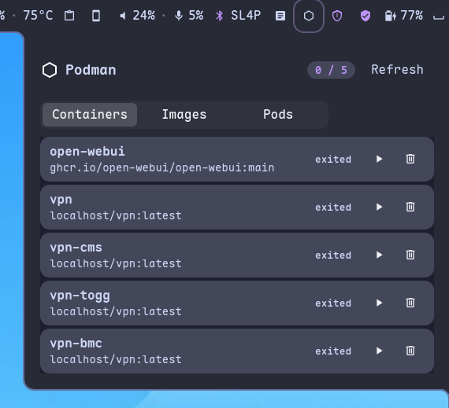
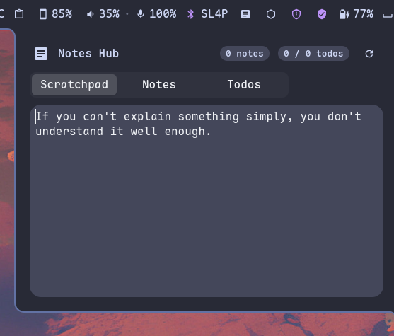

<p align="center">
  <picture>
    <source media="(prefers-color-scheme: light)" srcset="docs/assets/margo-banner.svg">
    
  </picture>
</p>

<p align="center">
  <em>A Wayland tiling compositor — Rust + Smithay, tag-based, with a complete first-party desktop: GTK4 shell, lock screen, login manager, monitor profiles and CLI tooling.</em>
</p>

<p align="center">
  <a href="LICENSE"></a>
  <a href="Cargo.toml"></a>
  <a href="https://github.com/Smithay/smithay"></a>
  <a href="https://kenanpelit.github.io/margo/"></a>
</p>

---

<blockquote align="center">
  <p><em>Margo is a deeply personal Linux desktop environment built by a single
  human amplified by AI — an experiment in whether one person can design,
  implement, and maintain a complete modern desktop stack alone.</em></p>
</blockquote>

---

**margo** is a Wayland compositor in the dwl/mango tradition — a Rust + [Smithay] port of [mango] with tags instead of workspaces, a deep tiling layout catalogue, and a complete first-party stack for everyday use: a GTK4 desktop shell (`mshell`) with bar / menus / notifications / OSD / settings UI, a control CLI (`mctl`), a screen locker (`mlock`), a TUI login manager (`mlogind`), monitor profiles (`mlayout`), and a screenshot helper (`mscreenshot`). The whole stack ships from one workspace and one release. The compositor speaks `dwl-ipc-v2` so third-party shells like [noctalia] also work — but you don't need one.

[Smithay]: https://github.com/Smithay/smithay
[mango]: https://github.com/mangowm/mango
[noctalia]: https://github.com/noctalia-dev/noctalia-shell

## Screenshots

<p align="center">
  
</p>

Everything below is part of the default install — the whole shell recolours
itself from your wallpaper with Material You.

<table>
<tr>
<td align="center" width="25%"><br><sub><b>Dashboard</b><br>clock · calendar · weather · quick-settings · media</sub></td>
<td align="center" width="25%"><br><sub><b>App launcher</b><br>fuzzy apps + ~15 providers</sub></td>
<td align="center" width="25%"><br><sub><b>Twilight</b><br>blue-light filter + schedule presets</sub></td>
<td align="center" width="25%"><br><sub><b>Power profiles</b><br>saver · balanced · performance</sub></td>
</tr>
<tr>
<td align="center" width="25%"><br><sub><b>DNS / VPN</b><br>one-tap preset switching</sub></td>
<td align="center" width="25%"><br><sub><b>Keep Awake</b><br>temporary idle inhibitor</sub></td>
<td align="center" width="25%"><br><sub><b>Podman</b><br>containers · images · pods</sub></td>
<td align="center" width="25%"><br><sub><b>Notes Hub</b><br>scratchpad · notes · todos</sub></td>
</tr>
</table>

<sub>These are eight of mshell's 30-plus widgets. More on the <a href="https://kenanpelit.github.io/margo/">documentation site</a>.</sub>

## Binaries

Each binary lives in its own top-level directory — the name links to it.

| Binary | Role |
| --- | --- |
| [`margo`](margo/) | Wayland compositor — DRM/KMS, tags, layout engine |
| [`start-margo`](start-margo/) | Watchdog supervisor — restart-on-crash, sd_notify, signal forwarding |
| [`mctl`](mctl/) | Compositor IPC + control CLI |
| [`mshell`](mshell/) | GTK4 desktop shell — bar, menus, OSD, in-app Settings |
| [`mshellctl`](mshellctl/) | Shell IPC CLI — menus, audio, wallpaper, lock |
| [`mlock`](mlock/) | Screen locker — `ext-session-lock-v1` + PAM |
| [`mlogind`](mlogind/) | TUI login / display manager — PAM, matugen-themed |
| [`mlayout`](mlayout/) | Named monitor profiles |
| [`mscreenshot`](mscreenshot/) | Screen / region / window capture |
| [`mpicker`](mpicker/) | Native colour picker — frozen screencap + zoom lens |
| [`mwizard`](mwizard/) | First-launch setup wizard launcher |
| [`mvisual`](mvisual/) | Renderer visual debugger |
| [`margo-portal`](margo-portal/) | xdg-desktop-portal screencast / screenshot backend |
| [`mshellshare`](mshellshare/) | Portal screencast helper |

Library-only crates (`margo-config`, `margo-layouts`, and the `mshell-crates/*` family) keep their descriptive prefix.

## Compositor highlights

- **Tags, not workspaces.** Nine multi-select tags; press the same tag twice to bounce back, several together to view a union, pin tags to a home monitor, regex-match windows into tags at map time.
- **Layouts that remember.** Tile, scroller, grid, monocle, deck, dwindle, center / right / vertical mirrors and an overview. Each tag holds its own layout choice.
- **Spring + bezier animations.** Niri-style spring physics with mid-flight retarget for window movement; bezier curves for open / close / tag / focus / layer transitions. SDF drop shadows, rounded corners, focus-fade opacity.
- **Modern protocol stack.** `ext-session-lock-v1`, `ext-idle-notify-v1`, DMA-BUF screencopy, `pointer_constraints` + `relative_pointer`, `xdg_activation` with anti-focus-steal, runtime `wlr_output_management`, VBlank-accurate `presentation-time`, `wp_color_management_v1`.
- **Window rules with PCRE2.** Float password prompts, pin apps to tags, screencast-blackout password managers, swallow terminal children, force CSD per-app — all by `app_id` / `title` regex. Accepts `width:50%` / `height:50%` monitor-relative fractions alongside absolute pixels (mango 0.13+ syntax).
- **Mango 0.13+ feature parity.** Drag-tile-to-tile (drag one tiled window onto another to swap them, optional 300×300 thumbnail during drag), split mouse / trackpad acceleration profiles, trackpad-specific scroll factor.
- **Twilight blue-light filter.** Static / Geo (sunrise-aware) / Manual / Schedule modes. Schedule mode reads sunsetr-compatible TOML presets from `~/.config/margo/twilight/` and interpolates in mired space between consecutive presets across the day; first run seeds a six-preset starter set the user can edit by hand or via `mctl twilight preset {list,set,remove,schedule}`.
- **In-compositor screencast portal.** Five Mutter D-Bus shims + a PipeWire pipeline so `xdg-desktop-portal-gnome` serves Window / Entire-Screen tabs without gnome-shell.
- **Embedded scripting.** Drop `~/.config/margo/init.rhai`; call any compositor action from a sandboxed Rhai interpreter, hook `on_focus_change` / `on_tag_switch` / `on_window_open`.
- **Hot reload.** `mctl reload` (or `Super+Ctrl+R`) re-applies window rules, key binds, monitor topology, animation curves, gestures — no logout.
- **DRM hotplug.** Dock / undock, plug a second monitor mid-session; outputs come and go cleanly.
- **`dwl-ipc-v2` compatibility.** Drop-in for [noctalia], waybar-dwl, fnott, and any other dwl/mango widget — that's how the bar / launcher / OSD / notifications surface on screen.

## Supervisor (`start-margo`)

A small Rust watchdog launcher. Start your session through it instead of calling `margo` directly:

```bash
# DM session line (e.g. /usr/share/wayland-sessions/margo.desktop)
Exec=start-margo

# Or under uwsm, replacing the compositor leaf:
uwsm app -a start-margo -- start-margo
```

Three improvements over Hyprland's `start-hyprland`:

1. **Crash budget.** `--max-restarts 3 --restart-window-secs 60` by default — after that many crashes in the window the supervisor exits non-zero, returning the user to the DM instead of pinning a CPU on a respawn loop with a broken config. `start-hyprland` will respawn indefinitely.
2. **systemd `sd_notify`.** Emits `READY=1` after spawn and `STOPPING=1` on shutdown, so a `Type=notify` unit (uwsm's `wayland-wm@.service` template) sees the session as active without polling.
3. **Signal forwarding preserves the signal.** SIGTERM / SIGINT / SIGHUP are forwarded as-is, so margo's own teardown (Wayland surface destruction, ext-session-lock cleanup, `session.json` snapshot) runs end-to-end. `start-hyprland` always sends SIGTERM regardless of what it received.

Shared with `start-hyprland`: `PR_SET_PDEATHSIG(SIGKILL)` so a `kill -9 start-margo` cannot leave an orphaned compositor; `--path` for dev/staging margo builds; `--` to forward everything after it to margo.

Ready-to-copy session glue (a Wayland-session `.desktop`, a uwsm wrapper, the `margo-session` launcher, and a systemd drop-in) lives in [`contrib/sessions/`](contrib/sessions/) — see its README for the quick install.

## Lock highlights

- **`mlock`** uses `ext-session-lock-v1`, so the compositor cooperates: locked sessions stay locked across mlock crashes, and only `margo`'s `force_unlock` keybind can break out. Renders a blurred wallpaper, large clock, time-of-day greeting, avatar (`~/.face` or AccountsService), frosted password card with shake-on-fail and an attempt counter. Authenticates the session owner via PAM. Battery indicator and `F1/F2/F3` power keys with a two-press confirmation banner.

## Login manager (`mlogind`)

- **`mlogind`** is a first-party **TUI login / display manager**, forked from [lemurs](https://github.com/coastalwhite/lemurs) (MIT/Apache-2.0) and brought under the workspace. It runs as a systemd service on a bare VT — no compositor needed to log in — drawing a `ratatui` greeter (user field + session switcher + password), authenticating through PAM, and launching the chosen X11 / Wayland session (margo included). Themed from the margo **matugen** palette via `$`-variables in `/etc/mlogind/variables.toml`; `sudo mlogind sync-theme` repaints it from the active wallpaper so the greeter matches the desktop. Power controls (`F1` Shutdown / `F2` Reboot / `F3` Suspend) and opt-in fingerprint login (`pam_fprintd`). The package ships its config + PAM + systemd unit to `/etc` (inert until you `systemctl enable mlogind`); it never auto-replaces your current display manager.

## Shell (`mshell`)

A first-party GTK4 + relm4 + gtk4-layer-shell desktop shell that consumes `dwl-ipc-v2` directly. No need to wire up an external shell unless you want one — `mshell` ships with everything below preconfigured, and Settings UI lives inside the same panel as the menus (no separate window).

- **Bar with configurable pill set.** Workspace pills (per-tag accent + window-count dots), active-window pill, clock, media player, network speed, battery, audio, tray, notifications. Plus the opt-in **A-series** (Privacy mic+cam indicator, CPU/RAM/Temp sysstat, Caps/Num/Scroll lock keys, Dark-mode toggle, KeepAwake idle-inhibit, rounded screen corners) and **B-series** (System-update count badge with right-click refresh, Display→Layout panel driving mlayout).
- **Composite menus.** Dashboard (hero + 2-col + power footer) folds clock, weather and quick-settings into a single panel; clock menu carries a noctalia-style calendar grid; session menu (`super+delete`) drives Lock / Logout / Suspend / Reboot / Shutdown with 3-second countdown confirmation; notifications menu with urgency bar, count badge, action buttons and date-grouped history.
- **OSD.** Brightness / volume / network-change pills with consistent 320 px noctalia-style geometry.
- **Wallpaper.** Per-tag wallpaper assignment, optional rotation timer, `mshellctl wallpaper next/prev/random` for scriptable cycling.
- **Idle.** `ext-idle-notify-v1` consumer; tray `KeepAwake` pill toggles the inhibit at runtime.
- **Settings UI.** Alphabetic sidebar with **Bar** at top level and **Widgets** as a group exposing every pill and menu as its own page. Live preview, debounced reload — slider drags don't thrash the compositor.
- **Sound.** Optional matugen-style palette (`mshell-matugen`) generates wallpaper-derived themes that drive both the shell and the compositor border / focus colours.

## Install

The repository ships a single installer, [`install.sh`](install.sh), that
detects your distribution and does the right thing — build, install, and
uninstall. Clone the repo and run it:

```bash
git clone https://github.com/kenanpelit/margo
cd margo
./install.sh            # build + install (detects distro)
./install.sh uninstall  # remove margo
./install.sh --help
```

It installs every binary (compositor + shell + helpers), the
`margo-portal` screencast/screenshot backend, the Wayland session entry,
example configs and layouts, and shell completions.

### Arch / CachyOS

**From the AUR** (recommended) — [`margo-git`](https://aur.archlinux.org/packages/margo-git)
builds the full stack from GitHub HEAD; any AUR helper resolves the
dependencies and builds it:

```bash
paru -S margo-git        # or: yay -S margo-git
```

It's a VCS (`-git`) package — re-running the same command rebuilds against
the latest `main`. Uninstall with `pacman -Rns margo-git`.

**From the repo** — `./install.sh` runs the bundled `PKGBUILD` through
`makepkg` + `pacman` (handy when working on the tree locally):

```bash
./install.sh            # makepkg build + pacman install
./install.sh uninstall  # pacman -R margo-git
```

### Ubuntu / Debian

> **Requires GTK ≥ 4.20.** margo's GTK4 bindings need GTK 4.19+, so
> **Ubuntu 24.04 LTS (GTK 4.14) is not supported** — and `apt upgrade`
> won't help, because an LTS keeps the same GTK for its lifetime. Use
> **Ubuntu 25.10+ / 26.04 LTS** (or any distro with GTK 4.20+). The
> installer verifies the GTK version up front and stops early with a
> clear message on older releases.

The Ubuntu path installs the build dependencies via `apt`, bootstraps a
current Rust toolchain with `rustup` if the system one is too old (margo
is Rust edition 2024), builds `gtk4-layer-shell` from source when it
isn't packaged, then compiles and installs to `/usr`. Every installed
path is recorded in `/usr/local/share/margo/install-manifest.txt`, so
`uninstall` removes exactly what was added.

```bash
./install.sh deps       # install build dependencies only (optional)
./install.sh            # deps + Rust + build + install
./install.sh uninstall  # remove (reads the install manifest)
```

### Manual (any distro)

```bash
cargo build --release --workspace
for bin in margo start-margo mctl mshell mshellctl mlock mlayout mscreenshot mvisual mlogind mwizard mpicker; do
  sudo install -Dm755 target/release/$bin /usr/bin/$bin
done
sudo install -Dm644 margo.desktop /usr/share/wayland-sessions/margo.desktop
```

System dependencies: `wayland`, `libinput`, `libxkbcommon`, `seatd`, `mesa`, `libdrm`, `pixman`, `pcre2`, `cairo`, `pango`, `pam`, `gtk4` (≥ 4.20), `gtk4-layer-shell`, `xorg-xwayland` (optional). Runtime: `grim`, `slurp`, `wl-clipboard` for screenshots; `wlr-randr` for live monitor re-layout; `notify-send` (libnotify) for `mscreenshot`'s notification action buttons.

### Nix flake

```bash
nix run github:kenanpelit/margo
```

The flake exposes `packages.default`, a `devShells.default` with `rust-analyzer` + `clippy`, plus `nixosModules.margo` and `hmModules.margo`.

## Configure

All user config lives in `~/.config/margo/`:

```
~/.config/margo/
├── config.conf        # margo — compositor
├── layout_*.conf      # mlayout — monitor profiles
├── twilight/          # mshell / mctl — blue-light filter
│   ├── schedule.conf  #   HH:MM → preset name lines
│   └── presets/       #   <name>.toml (static_temp + static_gamma)
└── mshell/            # mshell — shell config, themes, wallpapers
```

Start with the **[Configuration guide](https://kenanpelit.github.io/margo/configuration/)**; every option is documented in the **[full key reference](https://kenanpelit.github.io/margo/config-reference/)**, and a complete annotated `config.conf` ships at [`margo/src/config.example.conf`](margo/src/config.example.conf). Hot-reloadable — `mctl reload` (or `Super+Ctrl+R`) re-applies window rules, key binds, monitor topology, animation curves.

```ini
# config.conf — small excerpt
borderpx          = 3
border_radius     = 12
focused_opacity   = 1.0
unfocused_opacity = 0.9

tagrule = id:1, layout_name:scroller, monitor_name:DP-3
tagrule = id:7, layout_name:scroller, monitor_name:eDP-1

windowrule = tags:1, appid:^Kenp$
windowrule = isfloating:1, width:640, height:260, title:^(Authentication Required|Unlock Keyring)$

animation_clock_move = spring
animation_clock_tag  = bezier
animation_curve_open = 0.16,1.0,0.30,1.0

bind = super,       Return, spawn, kitty
bind = super,       q,      killclient
bind = super+ctrl,  s,      sticky_window
bind = super+ctrl,  r,      reload_config
bind = alt,         l,      spawn, mlock
bind = NONE,        Print,  screenshot-region-ui
```

Validate before reloading:

```bash
mctl check-config
```

## At a glance

A quick taste — the full CLI surface is in **[Companion tools](https://kenanpelit.github.io/margo/companion-tools/)** (or `<tool> --help`).

```bash
# Compositor inspection
mctl status                          # per-output: focused / tags / layout
mctl clients --tag 2                 # every window on tag 2 (table)
mctl outputs --json | jq '.[].name'
mctl focused                         # `app_id · title`, scriptable

# Compositor control
mctl dispatch togglefullscreen
mctl dispatch view 4                 # tag bitmask 4 = tag 3
mctl reload

# Twilight (built-in blue-light filter)
mctl twilight status                 # current temp / phase / source
mctl twilight set mode=schedule      # switch to preset schedule
mctl twilight preset list            # all presets + the active schedule
mctl twilight preset set evening 2300 92
mctl twilight preset schedule set 19:00 evening

# Layout profiles
mlayout suggest                      # propose & activate a preset
mlayout set vertical-ext-top         # apply a saved profile

# Screenshots
mscreenshot rec                      # region → editor → file + clipboard
mscreenshot rec --delay 3            # 3-second countdown for menus / tooltips
mscreenshot screen --output eDP-1    # pin to a specific monitor
mscreenshot window                   # focused window

# Shell
mshellctl menu show dashboard        # bring up the composite dashboard
mshellctl menu session lock          # one-shot lock from the session menu
mshellctl wallpaper next             # cycle wallpaper
```

## Scripting

Drop `~/.config/margo/init.rhai`; margo evaluates it at startup.

```rhai
// Auto-tag Spotify into tag 8
on_window_open(|| {
    if focused_appid() == "spotify" {
        dispatch("tagview", [tag(8)]);
    }
});

// Cycle the wallpaper when you land on tag 9
on_tag_switch(|| {
    if current_tag() == 9 {
        spawn("mshellctl wallpaper next");
    }
});
```

Engine: [Rhai] (pure Rust, sandboxed by default). Guide: **[Scripting](https://kenanpelit.github.io/margo/scripting/)** — every hook + callable action; engine internals in [`docs/scripting-design.md`](docs/scripting-design.md).

[Rhai]: https://rhai.rs

## Documentation

- **[Documentation site](https://kenanpelit.github.io/margo/)** — install, configuration, scripting, design notes (mkdocs-material).
- [`CHANGELOG.md`](CHANGELOG.md) — release-by-release history (Keep-a-Changelog).
- [`road_map.md`](road_map.md) — what's shipped, what's queued, design trade-offs.
- [`docs/`](docs/) — design notes for in-flight features and the post-install validation checklist.
- `mctl --help`, `mctl actions --verbose`, `mlock --help`, `mlayout --help`, `mscreenshot --help` — generated from source, always current.

## Acknowledgements

Built on [Smithay]. The compositor is a Rust rewrite of [mango](https://github.com/mangowm/mango) (which forked [dwl](https://codeberg.org/dwl/dwl), itself a dwm-on-wlroots descendant) — the tag model, pertag, layout algorithms and dwl-ipc protocol trace back through that line. The shell (mshell) is a fork of OkShell. Wayland protocol code is ported from [niri](https://github.com/YaLTeR/niri) (foreign-toplevel write-side, ext-workspace, virtual-pointer), and mshell widgets reimplement patterns from [noctalia](https://github.com/noctalia-dev/noctalia-shell). margo additionally borrows architectural patterns (not code) from niri (focus oracle, hotplug, screencast portal, transactional resize), [anvil](https://github.com/Smithay/smithay/tree/master/anvil) (Smithay's reference compositor) and [Hyprland](https://hypr.land) (color-management protocol shape). `mlock` follows the architecture of [nlock](https://github.com/OldUser101/nlock) and [waylock](https://codeberg.org/ifreund/waylock).

Derived portions are preserved under their respective licenses — see `licenses/`: mango, dwl, OkShell, niri (GPL-3.0-or-later), dwm and noctalia (MIT). margo is **GPL-3.0-or-later**. (margo is a pure-Smithay Rust compositor; it carries no wlroots, tinywl or sway code, so those upstream licenses are not included.)

## License

GPL-3.0-or-later. See [`LICENSE`](LICENSE).

<p align="center">
  <br>
  <sub>GPL-3.0-or-later</sub>
</p>
