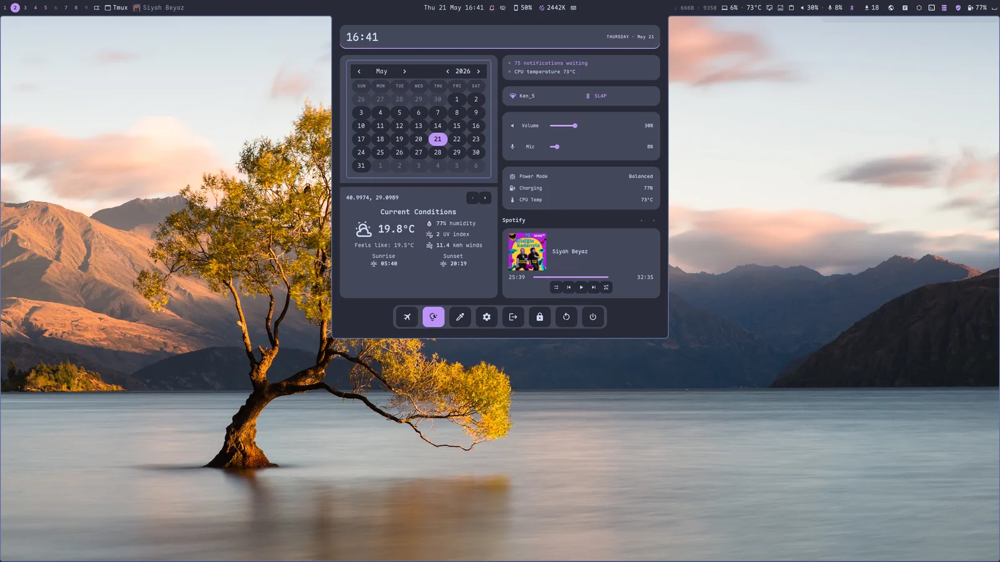
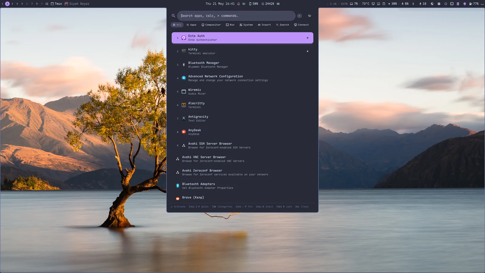
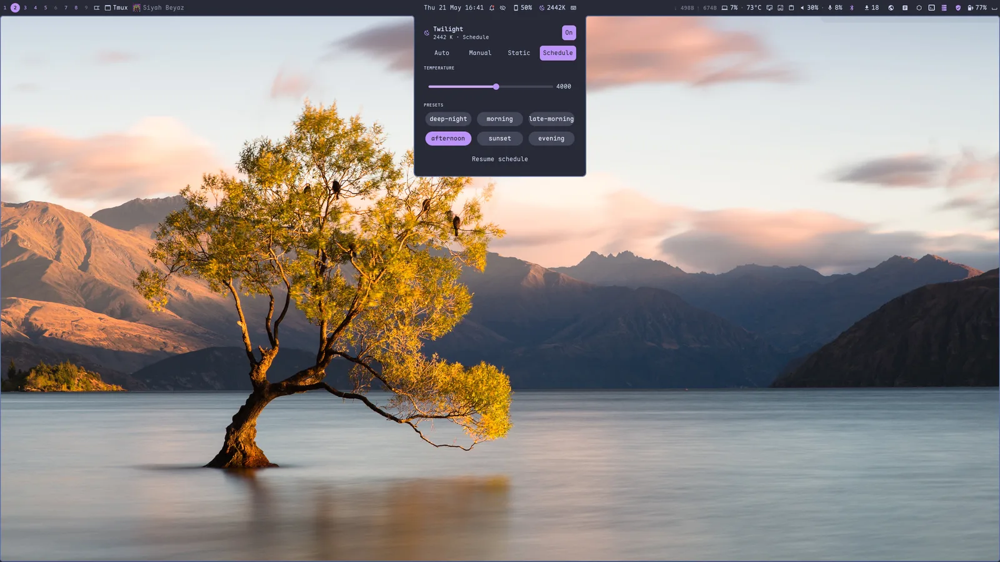
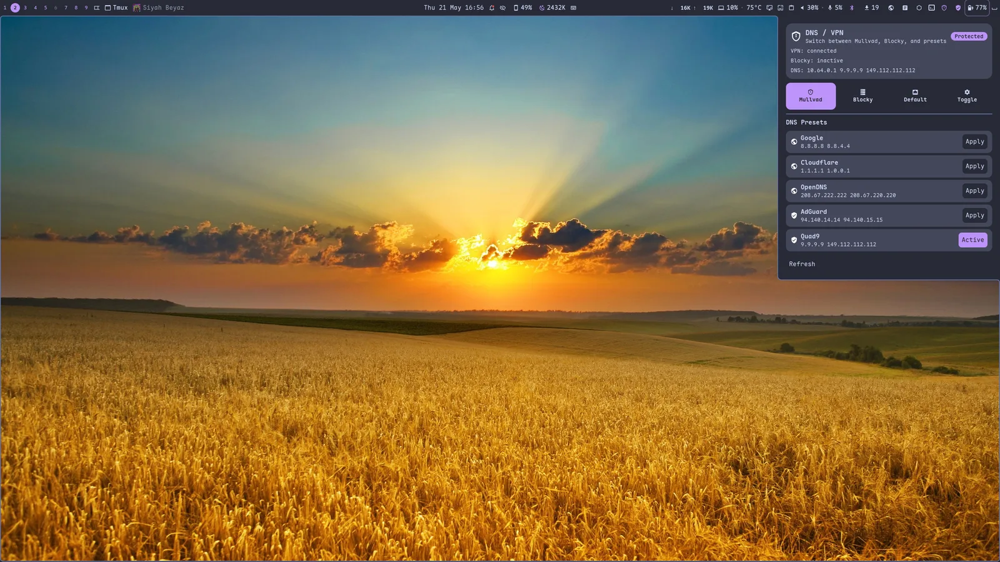
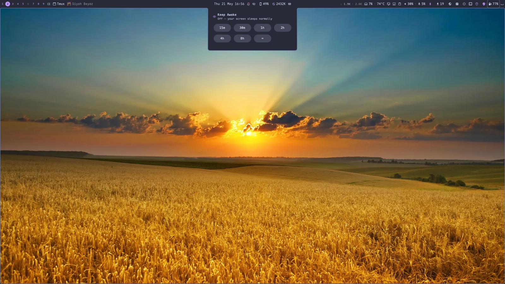
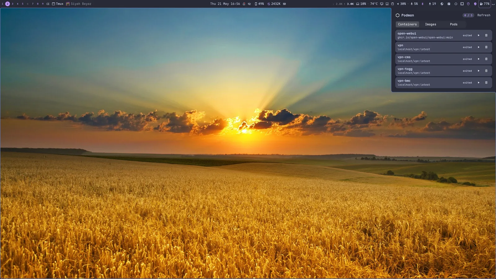
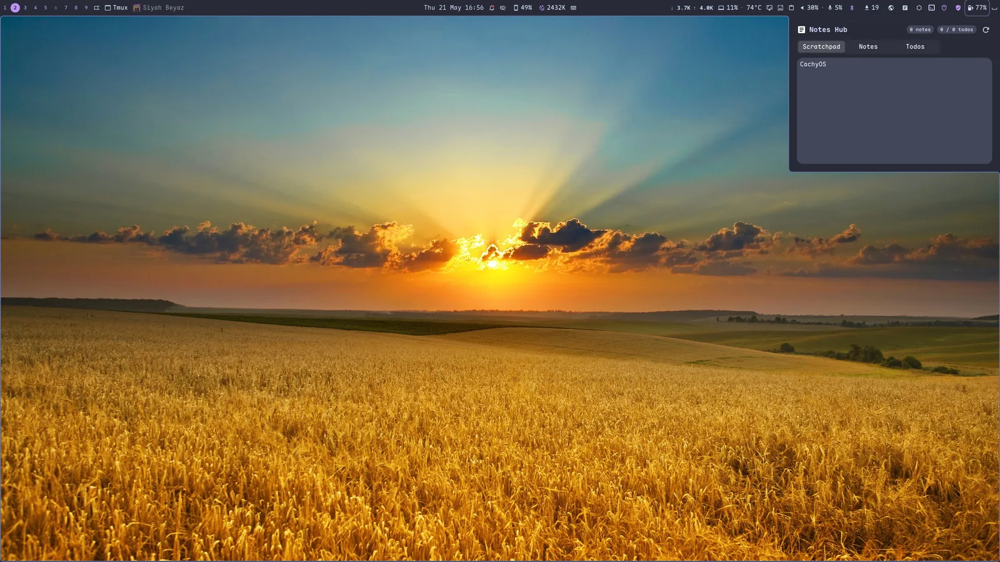

---
hide:
  - navigation
---

# margo

<p align="center">
  <picture>
    <source media="(prefers-color-scheme: light)" srcset="assets/margo-banner.svg">
    
  </picture>
</p>

<p align="center">
  <em>A Rust Wayland compositor <strong>and</strong> a full desktop shell — batteries included.</em>
</p>

<p align="center">
  <a href="https://github.com/kenanpelit/margo/blob/main/LICENSE"></a>
  <a href="roadmap/"></a>
  <a href="https://github.com/kenanpelit/margo"></a>
  <a href="https://github.com/kenanpelit/margo/actions"></a>
</p>

<blockquote align="center">
  <p><em>Margo is a deeply personal Linux desktop environment built by a single
  human amplified by AI — an experiment in whether one person can design,
  implement, and maintain a complete modern desktop stack alone.</em></p>
  <p><strong>— Kenan Pelit</strong></p>
</blockquote>

**margo** is a Wayland compositor in the dwl/dwm tradition — Rust + [Smithay],
tags instead of workspaces, a 14-layout tiling catalogue. But margo ships
something the others don't: **[mshell](#the-shell-mshell)**, a complete GTK4
desktop shell — bars, 30-plus widgets, an app launcher, a dashboard,
quick-settings, notifications, OSD, a lock screen, and a settings app — all
recoloured from your wallpaper with Material You. Plus a **native, GNOME-free
screen-share and screenshot portal**.

You don't assemble a desktop around margo. You install it and you have one.

{ loading=lazy }

[Smithay]: https://github.com/Smithay/smithay
[mango]: https://github.com/mangowm/mango

---

## Why margo?

niri, Hyprland, and mango are excellent **compositors** — but each leaves the
desktop to you: pick a bar (waybar), a launcher (rofi/fuzzel), a notification
daemon (mako/swaync), a lock screen, an OSD, a portal, a theming pipeline, and
wire them together. margo is a compositor **and** the desktop, designed as one
piece and themed as one piece.

| | **margo + mshell** | niri | Hyprland | mango |
|---|:---:|:---:|:---:|:---:|
| Language | Rust | Rust | C++ | C |
| **Bundled desktop shell** | ✅ mshell | ➖ BYO | ➖ BYO¹ | ➖ BYO |
| Bar + 30-plus widgets | ✅ | waybar | waybar | waybar-dwl |
| App launcher (15 providers) | ✅ | rofi | rofi | rofi |
| Dashboard + quick-settings | ✅ | — | — | — |
| Notifications / OSD / lock | ✅ | BYO | hypr* | BYO |
| **GNOME-free window screen-share** | ✅ margo-portal | xdp-gnome | xdph | — |
| Native screenshot portal | ✅ margo-portal | xdp-gnome | xdph | — |
| Material You from wallpaper | ✅ matugen | BYO | BYO | BYO |
| Blue-light filter (built-in) | ✅ twilight | — | hyprsunset | — |
| Tags (not workspaces) | ✅ 9 multi-select | columns | workspaces | ✅ dwm tags |
| Tiling layouts | 14 | scrollable | dynamic | dwl set |
| Embedded scripting | ✅ Rhai | — | hyprlang | — |
| Hot-reload everything | ✅ `mctl reload` | ✅ | ✅ | ✅ |

<small>¹ Hyprland's desktop is a family of separate `hypr*` projects you install and configure individually.</small>

The honest pitch: niri's scrollable tiling and Hyprland's ecosystem are great.
margo's bet is **one integrated, modern, Rust stack** — compositor + shell +
login (`mlogind`) + portals — that looks polished and works out of the box.

---

## Showcase

Everything below is part of the default install — no extra packages, no glue
scripts. The whole shell recolours itself from your wallpaper.

<div class="grid" markdown>

{ loading=lazy }

{ loading=lazy }

{ loading=lazy }

{ loading=lazy }

{ loading=lazy }

{ loading=lazy }

{ loading=lazy }

{ loading=lazy }

</div>

---

## The compositor

- **Tags, not workspaces.** Nine multi-select tags, dwm-style: press the same tag twice to bounce back, view a union of several at once, pin tags to a home monitor, or regex-match windows into tags at map time.
- **Layouts that remember.** Tile, scroller, grid, monocle, deck, dwindle, plus center / right / vertical mirrors and a global overview. Each tag keeps its own layout; switch tags and the layout follows.
- **Animations done right.** Niri-style spring physics with mid-flight retarget for window movement; tuned bezier curves for open / close / tag / focus / layer transitions. Drop shadows, rounded corners, focus-fade opacity, optional rounded screen corners.
- **Modern protocol stack.** DMA-BUF screencopy, `pointer_constraints` + `relative_pointer` for FPS games, `xdg_activation` with anti-focus-steal, runtime `wlr_output_management` (mode + position apply live), VBlank-accurate `presentation-time`, `wp_color_management_v1` for HDR-aware clients. See the [protocol comparison](protocol-comparison.md).
- **Window rules with PCRE2.** Float password prompts, pin apps to tags, blackout password managers from screencasts, swallow terminal children, force CSD per-app — all by `app_id` / `title` regex.
- **Embedded scripting.** Drop `~/.config/margo/init.rhai`; call any compositor action from a sandboxed Rhai interpreter and hook `on_focus_change` / `on_tag_switch` / `on_window_open` / `on_window_close`. Plugins via `~/.config/margo/plugins/<name>/`.
- **Hot-reload + DRM hotplug.** `mctl reload` (or Super+Ctrl+R) re-applies rules, keybinds, monitor topology, animation curves, and gestures with no logout. Dock / undock and multi-monitor hotplug work cleanly.
- **`dwl-ipc-v2` compatible.** Still a drop-in for noctalia, waybar-dwl, fnott, and any other dwl/mango widget — if you'd rather bring your own.

## The shell (mshell)

A GTK4 + relm4 desktop shell that talks to margo over `dwl-ipc-v2` and mirrors
its state live. Everything below is configured from a single YAML profile — no
scripting glue.

- **Top/bottom bars with 30-plus widgets.** Tags, layout switcher, active window, media player, clock, a rich **dashboard**, notifications, twilight, keybind cheatsheet, network console with traffic graphs, combined CPU / audio / power pills, Bluetooth, VPN, system-update count, clipboard history, screenshot/recording, wallpaper, SSH sessions, DNS, UFW, Podman, IP, notes, tray — arrange any of them in any slot.
- **App launcher with ~15 providers.** Apps (fuzzy + frecency), calculator, window switcher, SSH, clipboard, emoji, symbols, web search, Arch packages, audio devices, Bluetooth, power actions, scripts, settings deep-links — with Tab provider cycling, pin/unpin, exact-match toggle, and quick-activate keys.
- **Dashboard + quick-settings.** A hero clock, calendar + weather, an at-a-glance "overview intelligence" card, connectivity, audio, system status, media — plus a quick-action grid (airplane, nightlight, color picker, lock, logout, reboot, shutdown).
- **Material You theming.** matugen extracts a palette from your wallpaper and recolours the whole shell **and** the compositor's window borders. Wallpaper rotation, dark/light, and a live theme picker are built in.
- **Built-in twilight.** A blue-light filter with Auto / Manual / Static / Schedule modes, live temperature preview, and schedule presets — no `wlsunset`/`hyprsunset` needed.
- **The essentials, integrated.** Corner-toast notifications with history, volume/brightness OSD pulses, a PAM lock screen, idle management (dim → lock → suspend), clipboard history with pinning, polkit auth dialogs, and a native settings window.

## Screen sharing & screenshots — GNOME-free

margo ships **`margo-portal`**, its own `xdg-desktop-portal` backend, so a
margo session needs **no `xdg-desktop-portal-gnome`** at all:

- **Window & full-screen sharing** in Helium / Chromium / Firefox meeting
  clients (Meet, Jitsi, …). The source picker is mshell's own chooser; capture
  runs through the compositor's PipeWire pipeline.
- **A native Screenshot portal** — apps that ask the portal for a screenshot
  get one straight from the compositor.
- Plus the standalone tools: `mscreenshot` (region / window / output → file +
  clipboard + satty/swappy), `mpicker` (a zoom-lens colour picker), and a
  screenshot widget with RGB readout, magnifier, and inline annotation.

## Install

Arch / CachyOS — straight from the AUR:

```bash
paru -S margo-git        # or: yay -S margo-git
```

Any distro — the bundled installer:

```bash
git clone https://github.com/kenanpelit/margo
cd margo
./install.sh            # detects your distro: Arch/CachyOS or Ubuntu/Debian
```

One installer builds, installs, and uninstalls margo. See the
[install guide](install.md) for the per-distro details (and the GTK ≥ 4.20
requirement on Debian/Ubuntu).

## Where to next

<div class="grid cards" markdown>

-   :material-download:{ .lg .middle } **Install**

    ---

    `install.sh` for Arch/CachyOS or Ubuntu, source build, or Nix flake.

    [:octicons-arrow-right-24: Install guide](install.md)

-   :material-cog:{ .lg .middle } **Configure**

    ---

    `~/.config/margo/config.conf` — tags, rules, keys, animations.

    [:octicons-arrow-right-24: Configuration](configuration.md) · [Full reference](config-reference.md)

-   :material-tools:{ .lg .middle } **Companion tools**

    ---

    `mctl`, `mlayout`, `mscreenshot`, `mpicker` — drive margo from the shell.

    [:octicons-arrow-right-24: Companion tools](companion-tools.md)

-   :material-language-rust:{ .lg .middle } **Scripting**

    ---

    Embedded Rhai engine + plugin packaging.

    [:octicons-arrow-right-24: Scripting](scripting.md)

-   :material-compare:{ .lg .middle } **vs niri / Hyprland**

    ---

    Side-by-side Wayland protocol surface.

    [:octicons-arrow-right-24: Protocol comparison](protocol-comparison.md)

-   :material-map-marker-path:{ .lg .middle } **Roadmap**

    ---

    What's shipped, what's queued.

    [:octicons-arrow-right-24: Roadmap](roadmap.md) · [Changelog](changelog.md)

</div>

## Acknowledgements

Built on [Smithay] (compositor toolkit). Patterns and inventory borrowed from [niri](https://github.com/YaLTeR/niri) (focus oracle, hotplug, screencast portal, transactional resize), [mango](https://github.com/mangowm/mango) (feature inventory, IPC surface, default keybinds), [dwl](https://codeberg.org/dwl/dwl) (the original dwm-on-wlroots), [anvil](https://github.com/Smithay/smithay/tree/master/anvil) (Smithay's reference compositor), and [Hyprland](https://hypr.land) (color-management protocol shape).

Original portions of dwl, dwm, sway, tinywl, and wlroots are preserved under their respective licenses.
