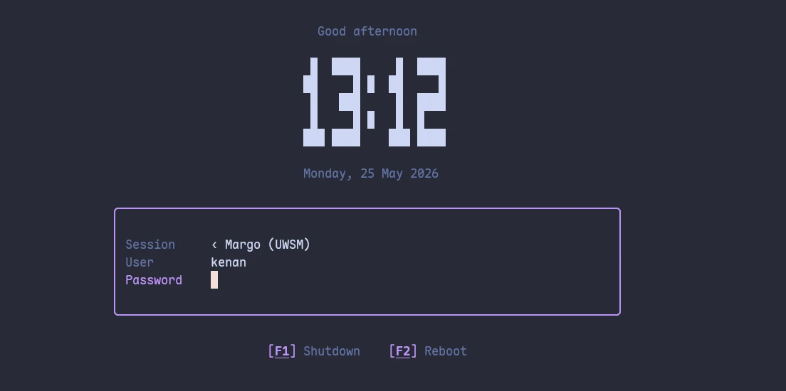

# mlogind

<p align="center">
  
</p>

margo's standalone **TUI login / display manager** — a bare-TTY greeter
that authenticates with PAM and launches your X11 / Wayland session
(including margo). It runs on the console itself; no compositor needs to
be running to log in.

> **Fork.** mlogind is a fork of
> [lemurs](https://github.com/coastalwhite/lemurs) by Gijs Burghoorn
> (MIT OR Apache-2.0 — see `LICENSE-MIT` / `LICENSE-APACHE`), brought
> under the margo workspace and being adapted + improved for it. Upstream
> credit and the dual license are preserved.

## Status

Work in progress. The import builds as the `mlogind` crate and the
internal `lemurs` → `mlogind` rename is done (config dir, PAM service,
cache/log paths, CLI). Margo-integration improvements — matugen theming,
shared auth with `mlock`, better session detection, fingerprint / u2f —
are tracked as follow-ups.

## How it works

1. A systemd service (`extra/mlogind.service`) runs `mlogind` as root on a
   dedicated VT.
2. mlogind draws a `ratatui` TUI: user + session switcher + password.
3. It authenticates the chosen user through PAM (service `mlogind`,
   configured at `/etc/pam.d/mlogind`).
4. On success it sets up the environment + utmpx record and execs the
   selected session (`/usr/share/{wayland-sessions,xsessions}` entries,
   or the script dirs below), returning to the greeter when it exits.

## Display host — native per-monitor resolution

A bare-TTY greeter shares one framebuffer (fbcon), so on a multi-monitor
setup every screen is forced to a single common mode — the external
monitor ends up at the laptop's resolution. Fixing that dynamically (each
monitor at its own EDID-preferred mode, whatever the port) is a KMS
capability a text greeter doesn't have.

`[display] host` in `config.toml` selects how the greeter reaches the
screen:

- **`host = "cage"` (default)** — the greeter runs inside
  [`cage`](https://github.com/cage-kiosk/cage) (a tiny wlroots kiosk
  compositor) hosting [`foot`](https://codeberg.org/dnkl/foot) (a Wayland
  terminal). cage drives KMS directly, so **every connected monitor
  lights up at its own native mode** — dynamic, auto-detected, no
  hardcoded resolution or port. `Ctrl+Alt+F<n>` VT switching keeps
  working. Architecturally this is a greetd-style split: a root
  *orchestrator* spawns `cage -s -- foot <mlogind> --greet`; the *greeter*
  does the real PAM auth and hands the validated `(user, session,
  password)` back over a private root-only tmpfs file
  (`/run/mlogind/result`, `0600`, shredded on read); the orchestrator
  re-runs PAM and launches the session on the bare VT, then re-greets on
  logout.
- **`host = "tty"`** — the classic in-process greeter rendered straight to
  the Linux VT (single shared framebuffer). This is also the automatic
  fallback whenever `cage`/`foot` is missing or cage fails to initialise,
  so a broken host is never a lockout.

Requires `cage` and `foot` (declared package deps). To sanity-check the
host without touching your real login manager, run it from a spare VT:

```bash
sudo XDG_RUNTIME_DIR=/run/mlogind cage -s -- foot -e mlogind --greet
```

## Paths

| Purpose | Default |
|---|---|
| Main config | `/etc/mlogind/config.toml` |
| Variables | `/etc/mlogind/variables.toml` |
| Wayland session scripts | `/etc/mlogind/wayland` |
| WM / X session scripts | `/etc/mlogind/wms` |
| X setup script | `/etc/mlogind/xsetup.sh` |
| Last user / session cache | `/var/cache/mlogind` |
| Logs | `/var/log/mlogind*.log` |
| PAM service | `/etc/pam.d/mlogind` (template: `extra/mlogind.pam`) |

## Usage

```bash
# Preview in an existing session (no root, no real login):
mlogind --preview

# Real use as your login manager: see "Enabling mlogind" below.
```

See `extra/config.toml` for the full set of customization options.

## Enabling mlogind

mlogind installs like any display manager but is **never auto-enabled** —
switching your login manager is a deliberate step. On a packaged install the
unit, config, and PAM stack are already in place
(`/usr/lib/systemd/system/mlogind.service`, `/etc/mlogind/`,
`/etc/pam.d/mlogind`); from a source build, install `extra/mlogind.service`,
`extra/mlogind.pam`, and `extra/config.toml` to those paths first.

```bash
# 1. Try it in your current session first (no root, no real login):
mlogind --preview                       # Esc to quit

# 2. Disable your current DM (skip if you have none):
sudo systemctl disable --now gdm        # …or sddm / lightdm

# 3. Enable mlogind — its unit Alias=display-manager.service makes it the DM:
sudo systemctl enable mlogind           # tty2 by default

# 4. Reboot:
sudo reboot
```

If step 3 reports that `display-manager.service` already exists, a stale DM
symlink is lingering: `sudo systemctl enable --force mlogind` overrides it
(or run step 2 first).

**Keep your old DM installed** until a clean reboot confirms mlogind works.
If login breaks, switch to another VT (`Ctrl+Alt+F3`), log in, and run
`sudo systemctl disable mlogind` to fall back.

A few knobs:

* **Different VT** — the unit ships tty2; for another, drop a `[Service]`
  `TTYPath=`/`StandardInput=tty` override under
  `/etc/systemd/system/mlogind.service.d/`.
* **Theme** — match the greeter to your wallpaper with `sudo mlogind
  sync-theme` (see [Theme sync](#theme-sync)).
* **Fingerprint** — see [Fingerprint](#fingerprint).

## Launching margo

margo already installs `/usr/share/wayland-sessions/margo.desktop`, so
mlogind lists **margo** out of the box and can launch it. For a supervised
launch — respawn-on-crash, signal forwarding, and `PR_SET_PDEATHSIG` (no
orphaned compositor) — install `extra/sessions/margo.desktop` over it; that
entry runs `start-margo` instead of the bare `margo` binary:

```bash
sudo install -m644 extra/sessions/margo.desktop /usr/share/wayland-sessions/margo.desktop
```

## Theme sync

mlogind reads its colours from `$`-variables in
`/etc/mlogind/variables.toml`. To match the active wallpaper, margo's
matugen writes the live palette to
`~/.config/margo/mlogind-variables.toml` on every theme change; push it to
the greeter with:

```bash
sudo mlogind sync-theme   # copies your palette → /etc/mlogind/variables.toml
```

## Fingerprint

Fingerprint login is handled at the PAM level, not in mlogind: its
conversation ignores `PAM_TEXT_INFO` prompts, so `pam_fprintd` reads the
finger from the sensor directly. Enroll (`fprintd-enroll`), then uncomment
the `pam_fprintd.so` line in `extra/mlogind.pam` (installed to
`/etc/pam.d/mlogind`) — it tries the finger and falls back to the password.

A live async "swipe now" prompt (reusing margo's `mshell-auth` fprintd
client) is a planned follow-up; today the synchronous auth simply blocks
until the finger or the password is given.
